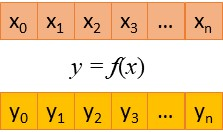

.. _universal_functions:
.. include:: ./../../ext_links.txt

Universal Functions
===================

The **Data Parallel Extension for Numba** supports universal function compilation. Universal function
is a scalar function applied to each array element.

In the above illustration the universal function `f(x)` takes a scalar input `x`
and returns the corresponding result `y`. It is applied to each array element ``x[i]`` and produces
an array ``y[]``.

The ``@vectorize`` decorator is used to specify the universal function.
It triggers a compilation of the function in a performant form on vector inputs.

``numba-dpex`` supports both **eager compilation** (decorator-time compilation, when type signatures are
provided in the decorator) and **lazy compilation** (call-time compilation, when type signatures are
inferred from inputs at a function call time).

.. seealso::
    `Creating NumPy universal functions <https://numba.readthedocs.io/en/stable/user/vectorize.html>`_

.. literalinclude:: ./../../../../numba_dpex/examples/kernel/vector_sum_ufunc.py
    :caption: **EXAMPLE: Vector sum implemented using @vectorize with lazy compilation**
    :lines: 5-

``numba-dpex`` allows calling universal functions from another compiled function. The following example
demonstrates calling ``@vectorize``-compiled function from ``njit``-compiled function.

.. literalinclude:: ./../../../../numba_dpex/examples/array_style/black_scholes.py
    :caption: **EXAMPLE: Calling universal function from @njit**
    :lines: 5-

.. note::

    Generalized unversal functions, decorated with Numba's ``@guvectorize`` are not supported
    in ``numba-dpex``

