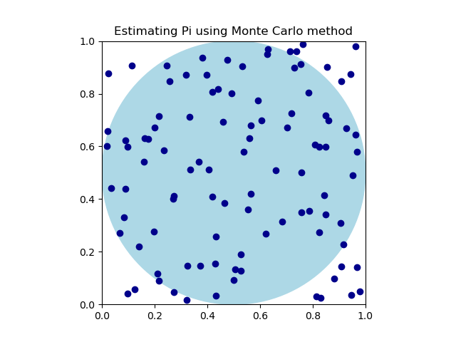

.. _rng:
.. include:: ./../ext_links.txt

Random number generation
========================

**Data Parallel Extension for Numba** provides a variety of *random number generator* routines to sample from
different statistical distributions. These generators rely on `Data Parallel Extension for Numpy*`_ ``dpnp.random``
capabilities, and can be used within ``@njit`` function.

Generating random numbers one by one may be very expensive. Instead, it is advised to generate random numbers
in *batches*. The batch size is hardware specific, and often determined by an experiment.

The following examples illustrate the usage of random number generators within ``@numba_dpex.njit`` decorator
to estimate :math:`\pi` using Monte Carlo method. This techniques relies on the fact that the area :math:`S` of a
circle of radius :math:`r=1/2` is :math:`S=\pi/4`.

By drawing uniformly distributed 2D random points in the unit
square, the proportion of points that falls into inscribed circle will be about :math:`\pi/4`. Hence, to estimate
:math:`\pi` one needs to draw large enough number of points :math:`(x, y)` within unit square, and calculate
how many of them are within :math:`x^2 + y^2 < 1`. Multiplied by 4 and divided by total number of 2D points
will provide an estimate of :math:`\pi`.

.. literalinclude:: ./../../../numba_dpex/examples/array_style/monte_carlo_pi.py
    :caption: **EXAMPLE: Monte Carlo Pi using array-style programming**
    :lines: 5-

In the above example instead of generating a full sample of 2D points in the unit square,
these are generated in smaller batches of ``BATCH_SIZE`` points in the function ``monte_carlo_pi_batch()``.
The full sample is generated by performing ``N_BATCHES`` calls to this function.

The advantage of this method, compared to the generation of a full sample in one call is that
it results in better data locality (and hence, allowing to use a faster memory) and also allows
additional concurrency such as asynchronous execution of the ``monte_carlo_pi_batch()`` function.

The only difference in the following implementation of the Monte Carlo method for estimation of :math:`\pi` is that
the direct ``prange`` loop is used for counting the number of points that fell within a unit circle.

.. literalinclude:: ./../../../numba_dpex/examples/direct_loops/monte_carlo_pi.py
    :caption: **EXAMPLE: Monte Carlo Pi using direct loop programming**
    :lines: 5-

.. note::

    Please note, that while using ``numba_dpex.prange`` loop you are advised to specify ``parallel=True`` and
    ``fastmath=True`` for the best performance.

.. seealso::

    Please refer to `Data Parallel Extension for Numpy*`_ documentation for further details.

.. seealso::

    Please refer to `Data Parallel Extension for Numba*`_ Reference Manual for detailed list
    of supported random number generation features
